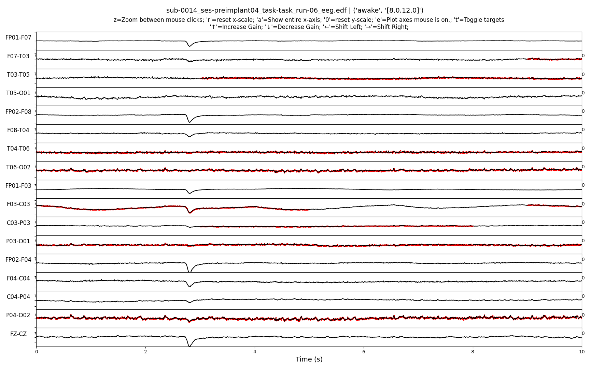
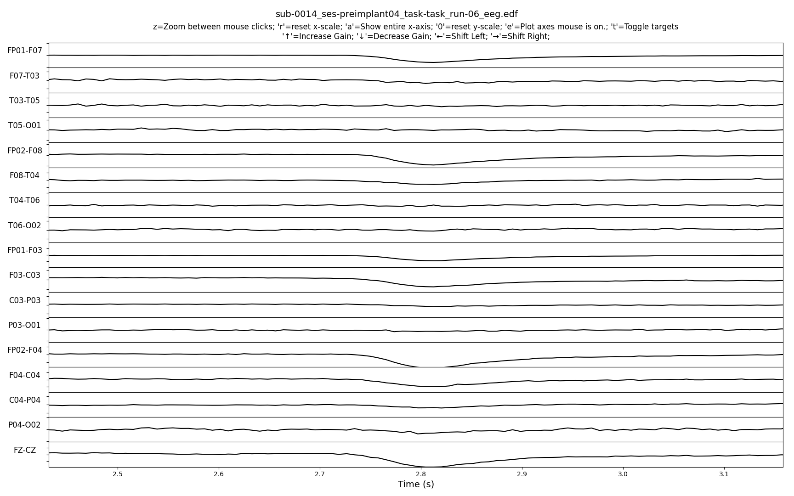
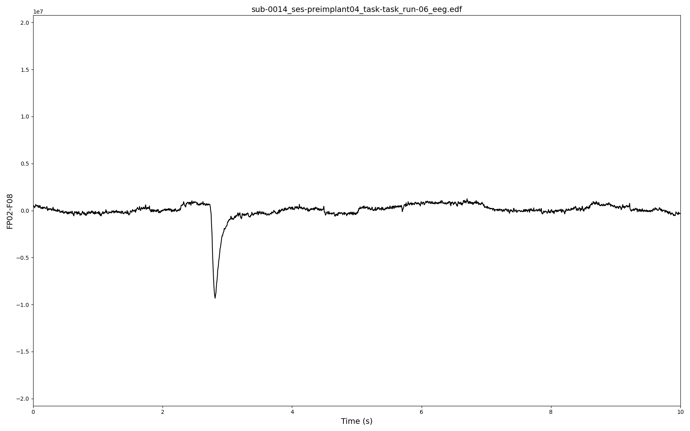

# Data Visualizations

## EDF Viewer

We provide a light-weight means of visualizing EDF data in a Python environment. This viewer uses the EPIPY as a backend to perform a number of important data clean up steps before visualiztion (at minimum it cleans channel labels, but can also montage or preprocess the data).

A few sample instantiations are provided below. Please consult the `--help` flag for more detailed information on different inputs to the viewer as these are just a few common uses.

### Random start time via seed (default behavior) with for all wildcard data matches
```
python utils/visualization/edf_viewer/edf_viewer.py --wildcard "../../../scalp_deep-learning/user_data/BIDS/BIDS/sub-0008/ses-preimplant01/eeg/sub-0008_ses-preimplant01_task-task_run-*_eeg.edf" --username bjprager --flagging
```

### Random start time via seed (default behavior) with for all wildcard data matches with a common average montage (default=bipolar)
```
python utils/visualization/edf_viewer/edf_viewer.py --wildcard "../../../scalp_deep-learning/user_data/BIDS/BIDS/sub-0008/ses-preimplant01/eeg/sub-0008_ses-preimplant01_task-task_run-*_eeg.edf" --username bjprager --flagging --montage common_average
```

### Random start time via seed (default behavior) with flagging for all wildcard data matches
```
python utils/visualization/edf_viewer/edf_viewer.py --wildcard "../../../scalp_deep-learning/user_data/BIDS/BIDS/sub-0008/ses-preimplant01/eeg/sub-0008_ses-preimplant01_task-task_run-*_eeg.edf" --username bjprager --flagging
```
flagging enables an interactive mode where the user can denote if certain events occur within the observed time window and save the results to a csv file.

By default the code outputs to `./edf_viewer_flags.csv` but can be changed using the `--outfile` option at runtime.

### Set start time of t=0 with flagging for wildcard datamatches
```
python utils/visualization/edf_viewer/edf_viewer.py --wildcard "../../../scalp_deep-learning/user_data/BIDS/BIDS/sub-0008/ses-preimplant01/eeg/sub-0008_ses-preimplant01_task-task_run-*_eeg.edf" --username bjprager --flagging --t0 0
```

### Set start time of t=0 and duration 15 with flagging for wildcard datamatches
```
python utils/visualization/edf_viewer/edf_viewer.py --wildcard "../../../scalp_deep-learning/user_data/BIDS/BIDS/sub-0008/ses-preimplant01/eeg/sub-0008_ses-preimplant01_task-task_run-*_eeg.edf" --username bjprager --flagging --t0 0 --dur 15
```

### Load a single edf file into the viewer
```
python utils/visualization/edf_viewer/edf_viewer.py --cli ../../user_data/EDF/sub-00149_ses-preimplant002_task-task_run-06_eeg.edf 
```

### Example Views
The default view for an EDF file following channel name cleanup and montaging might look like the following:


In this next example, by using the `t` button, we can highlight timepoints that might be of interest. In this case, we have data of interest in a sleep/wake study.


If we press t again, we can go to another series of timepoints of interest. We can also have multiple categories of interesting points, which results in different highlighting colors.


If we wish to zoom in on the data, we can left click to define an area of interest:


And by pressing `z` we can zoom in on that region (and reset the zoom by pressing `r`):


Finally, if we wish to look at just one channel closely, we can hover over the timeseries and press `e` to get a full plot zoom in:

